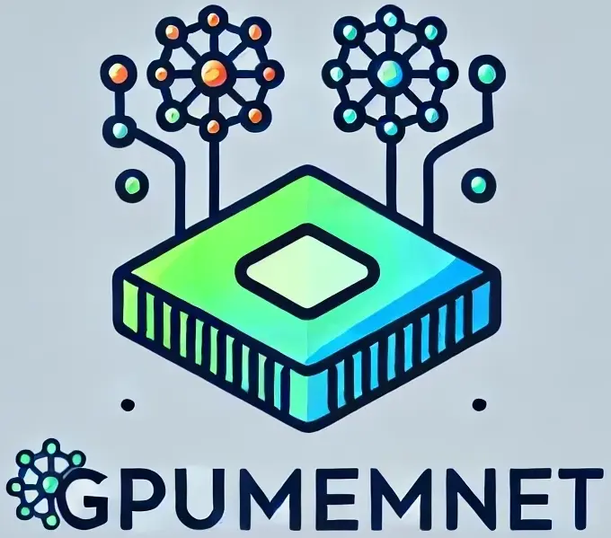

# GPUMemNet: GPU Memory estimator and Neural Network training dataset
<p align="center">
  
</p>

This repository keeps all the artifact on our work on building an AI-based estimator for deep learning training tasks. For having an AI-based estimator, data is the integral part. So, the goal of the scripts producing different deep learning training tasks and monitoring them while training is the first important step in this journey. After getting the raw data, cleaning the data is the next step as the corresponding scripts can be found as well. Finally analyzing the datasets and producing insights based data, and training models, and trying different approaches is the next step.

You can find the following material as follows:
- Python scripts named after the network's name in "NeuroNetGen_scripts" folder. You can find there their corresponding launchers for 3000 data points for training with different arguments.
- Python scripts to clean the data produced by the aforementioned scripts, in "Data_Cleaner_scripts" folder
- The dataset build throughout this work can be found in the "Dataset" folder
- Notebooks for analyzing the dataset, training models can be found in the "Analysis" folder. Each of the model architectures have their own separate analysis notebooks that can be found in the corresponding subfolder.

Overheads of inference [notebook](Ensemble/Overheads.md)
  <!-- - MLP step 1 dataset analysis [MLP Model](Analysis/01-MLP/02-mlp_with_activation_norm_dropout_1000MiB.ipynb)
  - MLP step 1 dataset analysis [Transformer Model](Analysis/01-MLP/02-MLP_step2_Transformer_1000MiB.ipynb)

  - MLP step 2 dataset analysis [MLP Model]()
  - MLP step 2 dataset analysis [Transformer Model]()
  
  - CNN step 1 dataset analysis [MLP Model]()
  - CNN step 1 dataset analysis [Transformer Model]()

  - Link to TIMM library dataset analysis [MLP Model]()
  - Link to TIMM library dataset analysis [Transformer Model]() -->

  ---
  For Future:
  - Link to Transformer dataset analysis []()

Read our paper to learn about them more.

## Vision
In the discussion section of our paper, we draw the roadmap on how contributors can contribute. As it is an AI-based estimator, the potential contributions and improvements to the current study can come from more data points, data points from different GPU models, with broader range of arguments, and also innovations on how to view the GPU memory estimation.

## Requirements
- PyTorch
- Torch summary
- Pandas
- Numpy
- ...

## Read and Cite

Ehsan Yousefzadeh-Asl-Miandoab, "GPUMemNet: GPU Memory Estimator and Neural Network data Generator"

```bibtex
This is the ref to the paper
```